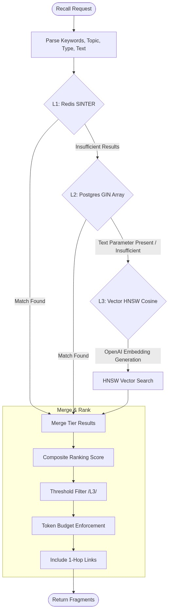
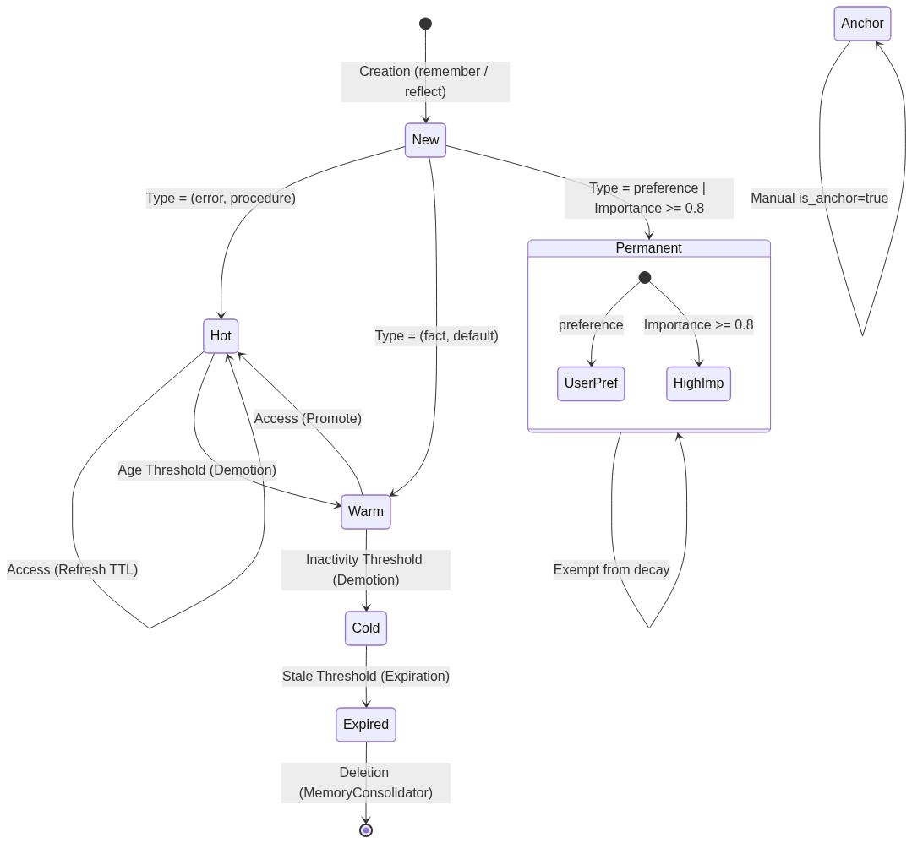
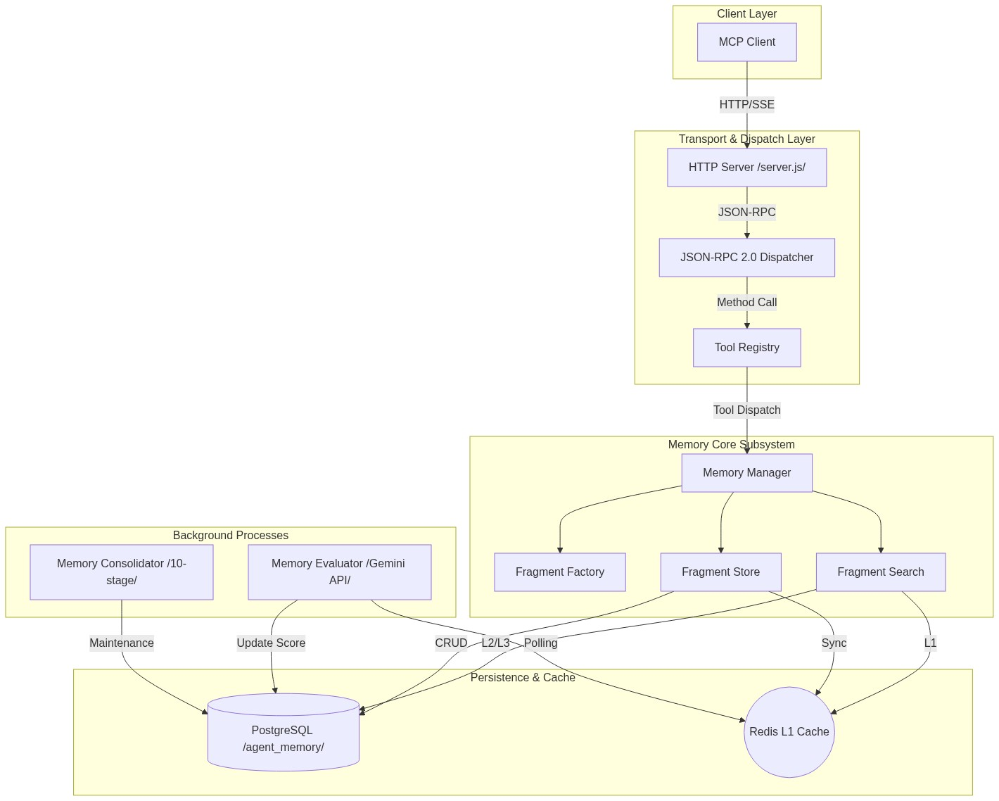

<p align="center">
  
</p>

# Memento MCP

> 원래 다른 직접 만든 MCP의 보조기능이었는데 쓰다보니 ㄱㅊ한거 같아서 배포용으로 분리함.

---

Claude, GPT 등 LLM을 실무에 쓰면서, 그리고 최근에 핫했던 오픈클로등을 쓰면서 매번 느끼는 좆같은게 있는데 세상 모든 개발 문서를 알고 있었으면서 바로 세션을 초기화 하기 전에 있었던 3초 전 일도 기억 못한다는 거.

세션을 닫으면 모든 맥락이 증발함.

금붕어가 3초밖에 기억 못한다는 속설이 있는데, 실제로는 몇 달을 감. 금붕어만도 못한거임.

마크다운 이것저것 세팅하는것도 한계가 있음. 내가 원하는대로 정확하게 맥락을 이해하는것도 복불복일뿐더러. 오픈클로를 실행해보면 그냥 아무것도 안한 상태에서 세션 시작한 것만으로도 4만자 이상의 컨텍스트를 잡아먹는데 돈이 살살녹는다는 뜻임.

그래서 생각한게 사람처럼 기억을 파편화 하고 연계구조를 통해 기억을 구체화 하는 과정을 모사하는 것이었음.

예를 들면 누가 갑자기 뜬금없이 나한테

> "야 너 미정이 기억나냐"

하면 나는 당장엔 아는사람 중에 그런 이름을 가진 사람도 없고 전혀 기억을 못 한체 "그게 누군데?" 라고 답할 것이다.

그러면 상대방은

> "그 왜 있자너 너 초등학교 1학년 때 짝궁이었던"

이정도 단서가 제공된다면 이제 어물어물 어떤 얼굴이 떠오른다. "아 그.. 그... 그래!"

좀 더 그 주제에 대해 생각해보면 책상 위에 선을 긋고 넘어오면 꼬집어댄 일이라던가, 지우개를 빌려주고 돌려받지 못 했던 일이라던지 하는 연관기억들이 떠오르고 구체화된다.

**이것이 Memento MCP의 요체다.**

---

## 1. Memento MCP는 무엇인가?

MCP(Model Context Protocol) 기반의 AI 중장기 기억 시스템이다. AI가 세션이 끝나도 중요한 사실, 결정, 에러 패턴, 작업 절차를 기억하고, 다음 세션에서 자연스럽게 불러올 수 있게 하는 것이 목적이다.

핵심 아이디어는 **"파편(Fragment)"** 에 있다.

세션 요약 전체를 뭉텅이로 저장하는 게 아니라, 1~3문장의 자기완결적 원자 단위로 쪼개서 저장한다. 찾을 때는 관련 원자만 정확하게 꺼내 오는것을 목적으로 한다.

---

## 2. 왜 "파편" 단위인가?

세션 요약을 통째로 저장하면 크게 두 가지 문제가 생긴다.

- **첫째**, 관련 없는 내용까지 컨텍스트 창에 밀어넣된다. 토큰의 낭비이고 돈낭비다. 그리고 나는 돈이 없다.
- **둘째**, 시간이 지나면 요약 안에서 필요한 부분만 골라내기가 어렵다.

파편은 하나의 사실, 하나의 결정, 하나의 에러 패턴을 담는다.

> "Redis Sentinel 연결 실패 시 REDIS_PASSWORD 환경변수 누락을 먼저 확인할 것. NOAUTH 에러가 증거다."

이게 파편 하나다. 필요한 사실만 꺼내온다.

---

## 3. 파편의 6가지 유형

각 유형마다 기본 중요도와 망각 속도가 다르다.

| 유형 | 설명 | 예시 | 망각 |
|------|------|------|------|
| `fact` | 변하지 않는 사실 | "이 프로젝트는 Node.js 20을 쓴다" | 가능 |
| `decision` | 선택의 흔적 | "커넥션 풀 최대값은 20으로 결정" | 가능 |
| `error` | 실패의 해부학 | "pg는 ssl:false 없이 로컬 연결 실패" | **불가** |
| `preference` | 인격의 윤곽 | "코드 주석은 한국어로 작성" | **불가** |
| `procedure` | 반복되는 의식 | "배포: 테스트 -> 빌드 -> push -> apply" | 가능 |
| `relation` | 사물 사이의 연결 | "auth 모듈은 redis에 의존한다" | 가능 |

`preference`와 `error`는 절대 망각하지 않는다. 취향은 너가 누구인지를 정의하고, 에러 패턴은 언제 다시 만날지 모르기 때문이다.


---

## 4. 삼층 캐스케이드 검색

기억을 찾을 때 세 개의 레이어를 순서대로 두드린다. 빠른 층에서 답이 나오면 느린 층은 건드리지 않는다.




| 계층 | 엔진 | 방식 | 속도 |
|------|------|------|------|
| **L1** | Redis 역인덱스 | 키워드 교집합으로 파편 ID 즉시 조회 | 마이크로초 |
| **L2** | PostgreSQL GIN | topic, type, keywords 조합 정형 쿼리 | 밀리초 |
| **L3** | pgvector HNSW | OpenAI 임베딩 기반 의미 검색. "인증 실패"와 "NOAUTH"가 같은 뜻이라는 걸 여기서 안다 | 수십~수백ms |

Redis와 OpenAI는 선택 사항이다. 없으면 해당 레이어 없이 작동한다. PostgreSQL만으로도 기본 기능은 돌아감.

---

## 5. TTL 계층 -- 기억의 온도

파편은 사용 빈도에 따라 `hot`, `warm`, `cold`, `permanent` 사이를 이동한다.



```
hot (자주 참조됨) → warm (한동안 침묵) → cold (오래 잠듦) → TTL 만료 시 삭제
                          ↑
                    다시 참조되면 hot으로 복귀
```

인간의 장기기억도 이렇게 작동한다. 오래 안 쓰면 잊히지만, 한번 떠올리면 다시 선명해지는 것.

---

## 6. MCP 도구 11개

| 도구 | 설명 |
|------|------|
| `context` | 세션 시작 시 핵심 기억 로드. 이전에 reflect 안 된 세션이 있으면 알려줌 |
| `remember` | 파편 저장. 저장 시 같은 주제의 유사 파편을 pgvector로 찾아 관계를 자동 연결 |
| `recall` | 삼층 캐스케이드 검색 |
| `reflect` | 세션 종료 시 경험을 파편으로 응고. 안 불러도 세션 닫힐 때 자동 실행됨 (AutoReflect) |
| `forget` | 파편 삭제 (해결된 에러 정리용) |
| `link` | 파편 간 인과 관계 설정 (`caused_by`, `resolved_by` 등) |
| `amend` | 파편 내용 수정 (ID와 관계는 보존) |
| `graph_explore` | 인과 체인 탐색 (장애 근본 원인 추적) |
| `memory_stats` | 저장소 통계 |
| `memory_consolidate` | 주기적 유지보수 (감쇠, 병합, NLI+Gemini 하이브리드 모순 탐지) |
| `tool_feedback` | 검색 품질 피드백 |

---

## 7. 권장 사용 흐름

```
1) 세션 시작  → context()로 기억 로드
               (이전에 정리 안 된 세션 있으면 힌트도 같이 옴)

2) 작업 중    → 중요한 결정/에러/절차 발생 시 remember()
               (유사 파편 자동 연결됨)
             → 과거 경험 필요할 때 recall()
             → 에러 해결 시 forget(에러) + remember(해결 절차)

3) 세션 종료  → reflect()로 세션 내용 영속화
               까먹고 안 불러도 세션 닫힐 때 자동 실행됨
```

---

## 8. 기술 스택

| 구성요소 | 필수 여부 | 역할 |
|----------|-----------|------|
| Node.js 20+ | 필수 | 런타임 |
| PostgreSQL 14+ (pgvector) | 필수 | 파편 저장, L2 검색, 벡터 검색 |
| Redis 6+ | 선택 | L1 캐시 검색, 세션 활동 추적 |
| OpenAI Embedding API | 선택 | L3 시맨틱 검색 + 자동 링크 |
| Gemini CLI | 선택 | 품질 평가, 모순 에스컬레이션, 자동 reflect |
| NLI 모델 (mDeBERTa ONNX) | 자동 포함 | 논리적 모순 즉시 탐지. CPU 전용, GPU 불필요 |
| MCP Protocol | 2025-11-25 | 통신 규격 |

PostgreSQL만 있으면 핵심이 돌아감. Redis 넣으면 L1 캐시 검색이 켜지고, OpenAI 넣으면 L3 시맨틱 검색 + 자동 링크가 켜지고, NLI 모델은 그냥 깔려있으니까 논리적 모순은 알아서 잡고, Gemini CLI까지 깔면 수치/도메인 모순 + 자동 reflect까지 풀가동됨. 하나씩 붙여도 되고 다 빼도 됨.

---

## 9. 실행 방법

```bash
# PostgreSQL 스키마 초기화
psql -U postgres -c "CREATE EXTENSION IF NOT EXISTS vector;"
psql -U postgres -d memento -f lib/memory/memory-schema.sql

# 서버 실행
npm install
# (팁) CUDA 설치 오류 시: npm install --onnxruntime-node-install-cuda=skip
npm start
```

MCP 클라이언트 설정에 아래를 추가하면 된다.

```json
{
  "mcpServers": {
    "memento": {
      "url": "http://localhost:56332/mcp",
      "headers": {
        "Authorization": "Bearer your-secret-key"
      }
    }
  }
}
```

---

## 10. 시스템 구조



---

## 11. 만들게 된 계기

실무에서 Claude를 쓰면서 매일 같은 맥락을 반복 설명하는 게 비효율적이라 느꼈다. 시스템 프롬프트에 메모를 넣는 방법도 써봤지만 한계가 명확했음. 파편 수가 늘어나면 관리가 안 되고, 검색이 안 되고, 오래된 정보와 새 정보가 충돌함.

개열받는건 이미 설명한 것, 세팅한것을 무한히 반복하게 만든다는 것이다. 내가 편하려고 AI를 쓰는 것인데 인증 정보가 없다고 해서 보면 있고 세팅 안돼있다고 해서 세팅 파일 직접 열어보면 다 돼 있고 어떤 세션의 AI는 이상할정도로 곤조를 부려대서 있는것도 없다 하고 할 수 있는걸 못한다고 뻗대면서 고집을 부린다. 철저하게 논파해서 말 잘듣게 해 봐야 그 때 뿐이다. 세션을 다시 시작하면 똑같은 일이 또 다시 반복된다.

마치 명문대를 수석 졸업했지만 매일 같이 뇌가 리셋되는 병을 앓고 있는 신입사원의 교육담당자가 된 느낌이었다.

이러한 고충을 해소하기 위해 기억을 원자 단위로 분해하고, 계층적으로 검색하고, 시간에 따라 자연스럽게 망각하는 시스템을 설계했다. 인간이 망각의 동물인 것 처럼, 이 시스템은 "적절한 망각"을 포함한 기억을 지향한다.

피드백, 이슈, PR 모두 환영.

---

## FAQ

<details>
<summary>변화하는 사실이나 결정은 어떻게 처리하나?</summary>

`amend`라는 도구로 내용만 덮어쓸 수 있음. ID는 그대로라서 연결된 관계도 안 끊어짐. 예를 들어 "배포 서버는 A"라는 기억이 있었는데 B로 바뀌었으면, 그 파편만 수정하면 "A 서버에서 에러 났었음 -> 이렇게 해결함" 같은 연결 고리가 그대로 살아 있음.

그리고 주기적으로 `memory_consolidate`를 돌리면, 서로 모순되는 파편을 3단계로 잡아냄. 먼저 pgvector가 비슷한 놈들을 추려내고, NLI(자연어추론) 모델이 "이거 모순이다/아니다"를 판정함. "서버는 절대 재시작 안 함" vs "매일 3시에 재시작함" 같은 논리적 모순은 NLI가 0.98 신뢰도로 즉시 잡음. Gemini 호출 없이. "최대값 20" vs "최대값 50" 같은 수치 모순은 NLI가 "잘 모르겠는데?" 하면 그때만 Gemini CLI로 넘김. 모순 확인되면 새 파편이 이기고, 옛날 파편 중요도는 반토막남.


</details>

<details>
<summary>키워드 검색인데 동음이의어/이음동의어는?</summary>

그래서 검색이 세 단계임. 첫 단계(L1)는 키워드 직접 매칭이라 빠르지만 "인증 실패"로 검색하면 "NOAUTH"는 못 찾음. 이때 결과가 부족하면 자동으로 다음 단계(L2, L3)로 넘어가게 되고 마지막 단계(L3)는 AI 임베딩 기반이라 "인증 실패"와 "NOAUTH"가 같은 뜻이라는 걸 알게 됨. 정확히 아는 건 빠르게 찾고, 말이 다른 건 깊이 들어가서 찾는 구조. 매번 비싼 AI 임베딩을 돌리는 게 아니라, 싼 검색부터 먼저 시도하는 것이 핵심.

</details>

<details>
<summary>다른 memory 서비스랑 뭐가 달라?</summary>

크게 세 가지.

1. **비용 절약.** 다른 서비스(Mem0 등)는 기억을 찾을 때마다 매번 OpenAI 임베딩 API를 호출함. Memento는 키워드로 바로 찾을 수 있으면 API 호출 없이 끝냄. 기억이 수백 개 쌓여도 API 비용이 비례해서 늘지 않고 더 효율적.

2. **기억 유형별로 망각 속도가 다름.** 에러 패턴이나 개인 선호는 절대 안 잊지 않고. 반면 일반적인 사실은 오래 안 쓰이면 천천히 사라짐. "완전 기억"도 아니고 "완전 망각"도 아닌, 인간처럼 중요한 건 오래 남고 덜 중요한 건 희미해지는 구조.

3. **기억 사이에 인과 관계를 연결할 수 있음.** "이 에러는 저 설정 때문이었고, 이렇게 해결했다"는 체인을 만들어두면 나중에 비슷한 에러가 났을 때 원인부터 해결까지 한 줄로 따라갈 수 있게 되고 단순히 기억을 쌓아두는 게 아니라, 기억들 사이의 관계를 지도로 만들게 되는거.

</details>

<details>
<summary>빠르지만 틀릴 수 있는 답을 택한 거냐?</summary>

L1에서 키워드로 바로 찾을 수 있으면 빠르게 끝내고, 못 찾으면 자동으로 시맨틱 검색까지 내려감. NOAUTH 동음이의어 케이스는 L1이 못 찾으니까 L3이 잡는 구조임. 핵심은 "매번 임베딩을 태우지 않는다"는 거지 "정확도를 포기한다"는 게 아님. 편의점 갈 때 택시 안 타는 거랑 같음.

</details>

<details>
<summary>Mem0는 threshold로 업데이트 판단하잖아</summary>

맞음. Memento도 `remember` 시 해시 충돌이면 merge함 (`merged: true` 반환). 거기에 더해서 지금은 `remember` 시점에 pgvector로 같은 주제 유사 파편을 직접 찾아서 `related`, `resolved_by`, `superseded_by` 같은 관계를 자동으로 걸어줌. 중복 정리는 consolidate에서 배치로 처리하고, 관계 생성은 저장 시점에 바로 하는 하이브리드 방식. Mem0가 저장할 때마다 실시간으로 전부 임베딩 비교하는 거랑 다르게, Memento는 저장은 빠르게 하되 유사도 기반 관계만 즉시 걸고 무거운 정리는 나중에 하는 구조.

</details>

<details>
<summary>edge 많아지면 관리 됨? TTL로 한계 있어 보이는데</summary>

맞음 ㅇㅇ. 세 가지로 제어하고 있음. `graph_explore`가 기본 1-hop 제한이라 무한 탐색 안 함. 파편 삭제되면 연결된 edge도 같이 정리됨. `recall`의 `tokenBudget`이 최종 캡이라 아무리 많아도 예산 안에서 잘림.

근데 "파편은 살아있는데 edge만 낡은 경우"에 대한 edge 단위 TTL은 아직 없음. 근데 현실적으로 개인 개발자 1:1 어시스턴트 기준으로 edge가 수만 개 쌓이는 일은 거의 없고, 엔터프라이즈 스케일은 내가 이걸로 장사를 할 때나 고려할 일.

</details>

<details>
<summary>reflect 깜빡하고 세션 닫으면 그 세션 기억 날아가는 거 아님?</summary>

예전엔 그랬음. 지금은 세션이 닫히거나 만료되거나 서버가 꺼질 때 AutoReflect가 자동으로 돌아감. 세션 동안 뭘 했는지(어떤 도구 썼는지, 어떤 키워드 검색했는지, 어떤 파편 만들었는지)를 SessionActivityTracker가 Redis에 쌓고 있다가, 세션 끝날 때 Gemini CLI가 그걸 요약해서 구조화된 파편으로 만들어줌. Gemini CLI 없어도 최소한의 기록은 남기고, 다음 세션 시작할 때 `context()`가 "야 이전 세션 정리 안 됐는데?" 하고 알려줌. 완전 안전하지는 않지만 예전처럼 증발하진 않음.

</details>

<details>
<summary>NLI가 뭔데 모순 탐지에 왜 쓰는 건데</summary>

Natural Language Inference. 두 문장 넣으면 "이 둘이 모순이냐 / 같은 말이냐 / 상관없냐"를 판정해주는 모델임. 핵심은 이게 로컬에서 CPU로 50-200ms만에 돌아간다는 것. Gemini 한 번 부르면 수 초에 API 비용까지 나가는데, 명확한 논리적 모순("절대 안 함" vs "매일 함")은 NLI가 0.98 신뢰도로 잡아버림. Gemini 호출이 필요 없어짐. NLI가 "잘 모르겠는데?" 하는 경우(숫자 차이 같은 거)만 Gemini한테 넘기니까, 전체적으로 Gemini 호출이 50-70% 줄어듦. `npm install`만 하면 모델이 알아서 깔리고 GPU도 필요 없음.

</details>
